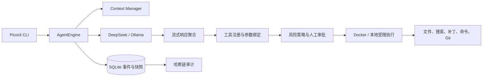

# AgentForge Java

AgentForge 是一个基于 Java 21 的 CLI 编程 Agent。它面向希望在本地代码仓库中引入 AI 编程能力，同时重视执行安全、过程可控、任务可恢复和结果可审计的开发者与工程团队。

项目将大模型视为“不可信的规划器”：模型可以提出工具调用，但文件访问、代码修改和命令执行必须经过类型校验、权限策略与沙箱边界，不能直接操作宿主环境。

## 面向谁

- 希望在 Java 项目中实践 Agent Loop、Tool Calling 和上下文管理的后端开发者。
- 需要把 DeepSeek 或 Ollama 接入代码仓库自动化流程的工程团队。
- 关注命令执行安全、人工审批、崩溃恢复和审计能力的平台开发者。
- 偏好 CLI 工作流，不需要 Web UI 或多 Agent 编排的个人开发者。

## 解决什么问题

### 将模型输出可靠地转换为工具调用

模型返回的工具名称和 JSON 参数可能被拆分在多个流式响应片段中。AgentForge 分别解析 DeepSeek SSE 与 Ollama NDJSON，按 ToolCall index 聚合参数，只有在调用完整后才进入工具注册、Schema 校验和参数绑定流程。

### 限制模型能够执行的操作

模型只能调用预先注册的工具，不能指定 Java 类或任意执行宿主代码。工具参数通过 Java record、Jackson 和受控 JSON Schema 进行校验；路径访问经过规范化与符号链接逃逸检查，命令使用 argv 形式执行。

### 隔离不可信命令

命令默认在 Docker 中运行，容器采用非 root 用户、工作区挂载、默认断网、CPU、内存、PID 和超时限制。本地执行模式需要显式开启，并且只允许白名单命令。

### 控制长任务的上下文和资源消耗

Agent Loop 同时管理迭代次数、墙钟时间、Token 预算和费用预算。当上下文接近模型窗口限制时，会保留系统约束、最近对话和未完成工具状态，并压缩较早历史。

### 支持中断恢复与人工介入

运行过程写入 SQLite append-only 事件流，并定期保存快照。任务中断后可以恢复消息、预算和执行状态；高风险工具调用可以暂停等待人工审批。对于已经记录执行意图但结果未知的非幂等操作，系统会进入 `UNCERTAIN`，避免静默重复执行。

### 提供可验证的审计记录

事件之间通过 SHA-256 前序哈希连接，形成可校验的审计链。会话可以导出为 Markdown 或 JSON，日志中的 Key、Token、Authorization 等敏感字段会被脱敏。

## 架构



AgentForge 使用 Maven 模块化单体，各模块通过核心 SPI 协作：

```text
agentforge-core            Agent Loop、状态机、上下文、预算与核心接口
agentforge-infrastructure  模型客户端、工具、策略、沙箱与 SQLite
agentforge-cli             Spring Boot non-web、Picocli 与交互审批
agentforge-eval            离线场景、报告模型与结果渲染
```

## 技术与框架

| 领域 | 技术 |
|---|---|
| 语言与构建 | Java 21、Maven Wrapper、Maven 多模块 |
| 应用装配 | Spring Boot non-web、Spring Dependency Injection |
| CLI | Picocli |
| 模型接入 | Java HttpClient、DeepSeek OpenAI-compatible API、Ollama API |
| 流式协议 | SSE、NDJSON、增量 ToolCall 聚合 |
| 类型与序列化 | Java record、注解反射、Jackson、JSON Schema |
| 持久化 | SQLite JDBC、事件溯源、快照恢复 |
| 安全执行 | Docker、argv 进程执行、工作区路径约束、风险策略 |
| 测试与质量 | JUnit 5、AssertJ、JaCoCo、GitHub Actions |

## 内置工具

- 列出工作区文件。
- 读取文本文件。
- 在工作区内搜索文本。
- 应用受大小限制的补丁。
- 以 argv 形式执行白名单命令。
- 查看 Git status 和 diff。

只读工具可以使用 Java 虚拟线程并行执行；文件写入和命令执行保持串行，避免并发修改造成状态竞争。

## 快速开始

需要 JDK 21。默认沙箱模式还需要 Docker；Ollama 仅在使用本地模型时需要。

```bash
./mvnw verify
docker build -f Dockerfile.sandbox -t agentforge-sandbox:java21 .
java -jar agentforge-cli/target/agentforge-cli-0.1.0-SNAPSHOT.jar doctor
```

### 使用 DeepSeek

```bash
export DEEPSEEK_API_KEY=your_key

java -jar agentforge-cli/target/agentforge-cli-0.1.0-SNAPSHOT.jar \
  run \
  --repo /path/to/java-repo \
  --task "修复失败测试并解释原因" \
  --provider deepseek
```

### 使用 Ollama

```bash
ollama pull qwen2.5-coder:7b

java -jar agentforge-cli/target/agentforge-cli-0.1.0-SNAPSHOT.jar \
  run \
  --repo /path/to/java-repo \
  --task "定位并修复空指针" \
  --provider ollama
```

### 本地受限执行

Docker 是默认执行模式。只有显式指定时才会在宿主机执行白名单命令：

```bash
agentforge run \
  --repo . \
  --task "运行单元测试" \
  --provider ollama \
  --sandbox local
```

## CLI

```text
agentforge doctor
agentforge run --repo <path> --task <text> --provider deepseek|ollama [--sandbox docker|local]
agentforge resume <session-id>
agentforge session list
agentforge session show <session-id>
agentforge report <session-id> --format markdown|json
```

## 配置

| 环境变量 | 作用 |
|---|---|
| `DEEPSEEK_API_KEY` | DeepSeek API Key |
| `DEEPSEEK_BASE_URL` | 覆盖 DeepSeek API 地址 |
| `OLLAMA_BASE_URL` | 覆盖 Ollama 服务地址 |
| `AGENTFORGE_STATE_DIR` | 指定 SQLite 状态目录 |

API Key 仅从环境变量读取，不会写入仓库、Prompt、事件或运行报告。

## 安全边界

AgentForge 将仓库内容、模型回复和工具输出都视为不可信输入。Docker 是默认隔离边界，但不是虚拟机：Docker daemon 权限、镜像供应链和宿主内核仍需要独立治理。

本地模式只提供命令白名单、工作目录限制、超时和输出上限，不应被视为强隔离环境。项目也不提供默认远程 Git push 工具，避免模型直接修改远程仓库。

## 当前范围

项目专注于单 Agent、单仓库的 CLI 编程流程，目前不包含 Web UI、多 Agent 编排、职位搜索或默认远程 Git 操作。

更详细的实现说明见 [技术手册](docs/technical-handbook.md)。

## License

[MIT](LICENSE)
