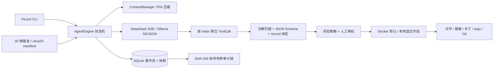

# AgentForge Java

> A Java 21 CLI coding agent built as an interview-ready backend systems project: streaming tool calls, typed reflection, policy enforcement, isolated execution, crash recovery, tamper-evident audit logs, and reproducible evaluation.

AgentForge 不是“套壳聊天机器人”，而是一个把模型视为不可信规划器、把工具执行视为受控后端事务的编程 Agent。项目面向后端/Agent 校招与实习面试：核心路径有代码、有测试、有运行数据，也明确写出尚未完成的边界。

## 为什么做这个项目

一个可解释的编程 Agent 至少要回答五个工程问题：模型输出怎样可靠地变成方法调用；命令为什么可以或不可以执行；上下文和费用怎样封顶；进程崩溃后怎样继续；“效果提升”如何复现。AgentForge 用四个 Maven 模块分别承载状态机、基础设施、CLI 与评测，避免把所有逻辑塞进一个 Loop。



## 可验证的技术点

- Agent Loop：30 次迭代、20 分钟、200k 输入、30k 输出、¥50 单任务费用和连续 3 次相同调用的独立终止条件。
- 流式协议：DeepSeek SSE 与 Ollama NDJSON 分开解析；按 tool-call index 拼接碎片，完整后才验证。
- 类型系统：Spring 扫描 `@AgentTool` Bean；只为受控 Java record 类型生成 Schema；Jackson 绑定后再校验范围。
- 安全：模型只给工具名和 JSON；路径规范化与符号链接检查；命令使用 argv；写入/执行串行；Docker 默认断网、非 root、2 CPU、4GB、256 PID。
- 恢复：SQLite append-only 事件 + SHA-256 前序哈希；快照包含消息、预算和模型信息；未落结果的非幂等调用恢复为 `UNCERTAIN`。
- 可观测：会话报告支持 Markdown/JSON，敏感字段脱敏；评测保留 JSON、CSV 与 manifest。

## 快速开始

要求 JDK 21、Docker（默认沙箱）；本地 Ollama 为可选项。

```bash
./mvnw verify
docker build -f Dockerfile.sandbox -t agentforge-sandbox:java21 .
java -jar agentforge-cli/target/agentforge-cli-0.1.0-SNAPSHOT.jar doctor
```

DeepSeek：

```bash
export DEEPSEEK_API_KEY=your_key
java -jar agentforge-cli/target/agentforge-cli-0.1.0-SNAPSHOT.jar \
  run --repo /path/to/java-repo --task "修复失败测试并解释原因" --provider deepseek
```

Ollama：

```bash
ollama pull qwen2.5-coder:7b
java -jar agentforge-cli/target/agentforge-cli-0.1.0-SNAPSHOT.jar \
  run --repo /path/to/java-repo --task "定位并修复空指针" --provider ollama
```

本地受限执行不会默认开启，只有显式传入 `--sandbox local` 才使用：

```bash
agentforge run --repo . --task "运行单元测试" --provider ollama --sandbox local
```

## CLI

```text
agentforge doctor
agentforge run --repo <path> --task <text> --provider deepseek|ollama [--sandbox docker|local]
agentforge resume <session-id>
agentforge session list
agentforge session show <session-id>
agentforge report <session-id> --format markdown|json
agentforge eval run --suite micro|java20 --profile baseline|full
agentforge eval render-readme
```

## 真实评测状态

表格由 `agentforge eval render-readme` 从原始报告生成，禁止手写挑选结果。

<!-- BENCHMARK:START -->
| Suite | Profile | Total | Passed | Pass rate |
|---|---|---:|---:|---:|
| micro | full | 30 | 30 | 100.0% |
<!-- BENCHMARK:END -->

- `micro/full` 是 30 个离线、确定性协议/安全/恢复不变量，不等价于模型解决真实 Issue 的能力。
- Java20 固定为 SWE-bench Multilingual revision `846e647b9f33c0b51b739d005d13d85493c9af09` 的 Java 样本按 `instance_id` 排序前 20 题。
- 本机已验证 Docker 29.5.2 沙箱镜像、非 root、断网、2 CPU、4GB 和 256 PID 边界；但完整 SWE-bench harness 与 20 个题目镜像尚未执行，因此 Java20 的 20 条记录全部标记为 `ENVIRONMENT_FAILED`，没有混入 resolved rate，也没有发生付费模型调用。
- DeepSeek 费用默认按 2026-09-24 官方高峰、缓存未命中价格保守估算：输入 ¥2/百万 token，输出 ¥8/百万 token；可通过环境变量覆盖，运行 manifest 必须保留价格快照。

### 真实 CLI 修复演示

2026-09-24 使用 `deepseek-flash` 在 Docker 沙箱修复一个独立 Java 示例：定位 `Calculator.add` 的减法错误，应用 1 行补丁，依次执行 `javac` 和测试主类。结果来自 SQLite 快照和哈希链事件，不是手填估算。

| 结果 | 模型迭代 | 工具调用 | 人工审批 | 输入 token | 输出 token | 估算费用 |
|---|---:|---:|---:|---:|---:|---:|
| `PASS CalculatorTest` | 6 | 7/7 成功 | 3 | 8,332 | 641 | ¥0.021792 |

从 session 开始到完成约 101.3 秒，其中约 91 秒是等待人工输入，不能当作模型纯执行延迟。完整事件摘要见 [demo-run.md](benchmark-results/2026-09-24/demo-run.md)。

复现方法和结果字段见 [评测说明](docs/evaluation.md)。

## 工程结构

```text
agentforge-core            状态机、上下文、预算、核心 SPI
agentforge-infrastructure  Provider、工具、策略、沙箱、SQLite
agentforge-cli             Spring Boot non-web、Picocli、交互审批
agentforge-eval            manifest、微基准、指标与报告生成
```

最终本机验收：`./mvnw verify` 运行 50 个测试、0 失败；JaCoCo core 行覆盖率 96.64%、分支覆盖率 82.99%，全项目行覆盖率 75.29%。CI 在 Linux/Windows 重跑，并用 `scripts/check_coverage.py` 强制门槛。

## 安全边界

仓库内容、模型回复和工具输出都按不可信输入处理。Docker 是默认边界，但它不是虚拟机：宿主 Docker daemon 权限本身很高；镜像供应链和内核漏洞仍需独立治理。本地模式只提供 allowlist、工作目录、超时和输出上限，不是强隔离。AgentForge 不把 API Key 写进仓库，也不提供默认远程 Git push 工具。

## 已知限制与路线图

- 首版没有 Web UI、多 Agent、职位搜索或默认远程 Git 操作。
- Java20 命令输出固定 manifest 与诚实的环境失败记录；完整 SWE-bench harness 仍需按 `docs/evaluation.md` 执行并回填预测文件。
- 上下文压缩是确定性摘要而非第二次模型调用，优先控制成本和可恢复性；后续可加入可验证语义摘要。
- OTLP 为路线图项，当前主交付是 JSONL/SQLite/Markdown/JSON。
- Schema 修复当前通过结构化错误让模型下一轮自行修正；“最多一次”的专用重试计数仍可进一步独立化。

## 深入阅读

- [技术手册](docs/technical-handbook.md)
- [120 题面试指南](docs/interview-guide.md)
- [简历与项目讲述](docs/resume-project-story.md)
- [评测复现](docs/evaluation.md)
- [设计文档](docs/superpowers/specs/2026-09-24-agentforge-design.md)

## License

[MIT](LICENSE)
