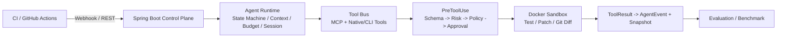

# AgentForge 项目梳理文档

> 依据《AgentForge：业务驱动型 Java Agent 优化方案》落地。本文档是项目的整体说明：定位、目标、架构、模块、安全模型、可靠性、控制面、评测与实现边界。

## 1. 项目定位

**CI Failure Diagnosis & Controlled Auto-Fix Agent（CI 失败诊断与受控自动修复 Agent）。**

针对 CI 失败后的日志阅读、代码定位、问题诊断、测试复现和 Patch 验证流程，构建 Java Agent Runtime：LLM 负责规划和推理，Java 后端负责 Tool 调度、权限控制、上下文组装、状态恢复、沙箱执行和审计。

核心思想：**不是"让 LLM 自由执行"，而是"让不可信的 LLM 在可控、可恢复、可审计的执行框架里完成真实工程任务"。**

## 2. 业务痛点与目标

**痛点**：CI 失败后需要在 Workflow、Job、日志、Commit、Diff、代码和测试之间反复切换；日志只呈现现象，根因往往在最近变更、依赖、配置或测试代码；普通代码 Agent 直接持有文件/命令/Git 权限会带来越权、错误修改和重复副作用。

**目标**：

- 接收 CI 失败任务并建立独立 Agent Session；
- 获取失败 Job、日志、Commit、Diff 和相关代码上下文；
- 通过 Tool Calling 完成代码搜索、文件读取、测试执行和 Patch；
- 所有 Tool 调用经过 Schema 校验、风险分类和权限策略；
- 高风险操作需要人工审批；测试和 Patch 在隔离环境执行；
- 保存 Event、Checkpoint 和 Snapshot，支持失败恢复；
- 通过确定性测试与 CI Case 衡量 Agent 是否真的完成任务。

## 3. 总体架构



数据流：Webhook → HMAC 验签 → 幂等建任务 → Context 组装 → 引擎六阶段状态机（每阶段写 AgentEvent）→ PreToolUse 门禁 → 沙箱执行 → ToolResult + Snapshot → 挂起/完成 → 指标聚合。

## 4. 模块划分与职责

| 模块 | 职责 |
|---|---|
| `agentforge-core` | Agent 状态机（PLAN→VALIDATE→PRE_TOOL_USE→EXECUTE→OBSERVE→REFLECT）、ToolExecutionGate、上下文管理、预算、Checkpoint/Snapshot SPI、SessionMetrics |
| `agentforge-infrastructure` | 模型客户端（DeepSeek SSE / Ollama NDJSON）、`github` 包（API Adapter、Webhook 验签、上下文组装）、`ci` 包（GitHub 读取工具、runTargetedTest、gitCommit/gitPush、createPullRequest）、`mcp` 包（MCP stdio 桥）、沙箱、策略引擎、SQLite 事件存储 |
| `agentforge-cli` | Spring Boot non-web + Picocli：`run`、`ci`、`resume`、`session`、`report`、`eval`、交互式审批 |
| `agentforge-server` | Control Plane：Webhook 接收、Task/Session 管理、审批 API、指标 API、Actuator、有界任务执行器、Task/Session 持久化 |
| `agentforge-eval` | 38 项确定性 Runtime 回归用例、离线 CI Agent Benchmark、SWE-bench Java 清单与报告 |

## 5. Agent 状态机与 PreToolUse 门禁

引擎把循环重构为显式六阶段，每阶段进入时写 `PHASE_ENTERED` 审计事件：

| 阶段 | 职责 |
|---|---|
| PLAN | 预算检查、上下文压缩、模型交换 |
| VALIDATE | 工具存在性、参数 Schema 校验（失败写 `VALIDATION_FAILED`）、重复调用防护 |
| PRE_TOOL_USE | 统一拦截链 Schema→Risk→Policy→Approval；ASK 时可挂起等待人工决定（`WAITING_APPROVAL`） |
| EXECUTE | 先写 `TOOL_INTENT` 再执行工具 |
| OBSERVE | 写 `TOOL_RESULT`，把结果反馈给模型 |
| REFLECT | 决定继续、结束或等待审批 |

风险等级：READ（低风险读取）/ EXECUTE（沙箱+超时+资源限制）/ WRITE（高风险，策略控制）/ NETWORK（外部副作用，审批）/ DESTRUCTIVE（默认禁止）。

## 6. Context Engineering

不把整个仓库塞进 Prompt。`CiContextAssembler` 按 Token 预算（默认 4000）组装最小必要上下文：失败 Workflow/Job/Log、失败测试与异常堆栈、最近 Commit/Diff、相关文件、构建命令、诊断指令。固定结构先预留字符，剩余预算按 Log 40% / Test 20% / Diff 20% / Stack 10% / 列表 10% 分配，保证总字符数 ≤ maxTokens×4。

## 7. 可靠性设计

| 机制 | 设计 |
|---|---|
| Session Isolation | 每个 CI 任务独立拥有 SessionId、仓库、Commit SHA、权限、预算、Checkpoint 和事件流 |
| Checkpoint / Resume | Tool 前记录 TOOL_INTENT，完成后记录 TOOL_RESULT；故障后从 Snapshot + Event Replay 恢复；审批挂起把 PendingApproval 存入快照，`resume(sessionId, decision)` 继续 |
| UNCERTAIN | 非幂等调用结果未知时不自动重放，进入 UNCERTAIN，避免重复副作用 |
| Sandbox | Docker 非 root、默认断网、CPU/内存/PID/超时限制；runTargetedTest 的容器允许网络以解析依赖（文档化例外，仍受限） |
| Policy | 工具白名单、参数校验、风险分类、人工审批和高风险拦截 |
| Audit | AgentEvent 记录模型请求、ToolCall、策略决策、执行结果、状态变化和恢复过程；SHA-256 前序哈希链防篡改 |

## 8. Control Plane

`agentforge-server`（Spring Boot Web + Actuator）：

- `POST /api/v1/webhooks/github`：HMAC-SHA256 验签，`workflow_run`/`workflow_job` 失败事件幂等建任务（repository+commit_sha+workflow_run_id 唯一键），并自动拉取失败 Job/日志/Commit/Diff 组装上下文；
- `POST/GET /api/v1/tasks[/{id}]`：任务创建（手动/Webhook）与查询；
- `GET /api/v1/sessions/{id}[/events|/report]`：会话状态、指标、脱敏事件流与报告；
- `GET/POST /api/v1/approvals[/{id}]`：待审批列表与人工决定（决定后恢复挂起会话）；
- `GET /api/v1/metrics`：任务状态分布、工具调用数、失败数、Token/费用、待审批数；
- 持久化：SQLite 表 `agent_tasks`、`pending_approvals`（与事件流同库，加法迁移）；存储走接口，PostgreSQL 可后续替换；
- 并发：固定线程池（默认 2）限制全局 Agent 资源；不引入 MQ（文档明确不堆技术）。

## 9. GitHub 与 MCP 集成

- **GitHub Adapter**（`infrastructure.github`）：`GitHubApiClient`（listWorkflowRuns/getWorkflowRun/getFailedJobs/getJobLogs/getCommit/getDiff，302 跟随且不向下载地址转发 Authorization）、`GitHubWebhookVerifier`（HMAC-SHA256 常量时间比较）、`GitHubWebhookParser`。
- **MCP**（`infrastructure.mcp`）：官方 MCP Java SDK 1.1.4 stdio transport；每个 server 暴露的工具注册为 `serverName.toolName`，默认 NETWORK 风险、非幂等；崩溃返回 MCP_ERROR 不自动重试。`CompositeToolRegistry` 把 Native @AgentTool 与 MCP 工具统一进 Tool Bus，未配置 MCP 时零开销。

## 10. 评测体系

| 套件 | 内容 |
|---|---|
| `micro`（38 项） | 确定性 Runtime 回归：流协议（6）、工具 Schema（6）、安全边界（8）、沙箱运行时（4）、Agent 循环（6）、恢复与审计（4）、Webhook（2）、上下文（2） |
| `ci-agent`（2 项） | 离线 CI Agent Benchmark：合成仓库注入失败测试，脚本化模型走 读日志→读代码→Patch→定向测试 闭环；`ci/retry` 验证失败观测驱动二次修补（REFLECT） |
| `java21` | SWE-bench Multilingual Java 固定 20 题清单（轻量命令如实标记环境失败，不伪造 resolved） |

指标：Task Success Rate、Patch Success Rate、Test Pass Rate、Tool Success Rate、Schema Error Rate、Avg Tool Calls、P95 Runtime、Token Cost、Recovery Success Rate、Unsafe Action Rate。

## 11. 与原方案的实现边界对照

| 方案要求 | 状态 |
|---|---|
| MCP Tool 接入 | ✅ `McpToolBridge`（stdio）+ 统一 Tool Bus |
| PreToolUse 统一拦截层 | ✅ `ToolExecutionGate`（Schema→Risk→Policy→Approval） |
| GitHub Actions Webhook/API Adapter | ✅ Adapter + 验签 + 幂等 |
| Spring Boot Control Plane | ✅ `agentforge-server` Web + Actuator |
| AgentTask/AgentSession 服务端持久化 | ✅ SQLite `agent_tasks`/`pending_approvals` + 会话事件流 |
| CI 失败→诊断→Patch→测试闭环 | ✅ `ci` 命令 + CI 工具 + 上下文组装 + 离线 Benchmark 证明 |
| Runtime Eval 与 CI Benchmark | ✅ 38 项回归 + ci-agent 套件 |
| 显式状态机 | ✅ 六阶段 + 阶段事件 |
| 指标 | ✅ SessionMetrics + `/api/v1/metrics` |

## 12. 使用方式

```bash
# CLI：CI 失败诊断
java -jar agentforge-cli/target/agentforge-cli-0.2.0-SNAPSHOT.jar ci \
  --repo /path/to/repo --github-repo owner/repo --run 123456

# Control Plane
GITHUB_WEBHOOK_SECRET=xxx DEEPSEEK_API_KEY=yyy \
  java -jar agentforge-server/target/agentforge-server-0.2.0-SNAPSHOT.jar
```

## 13. 路线图与诚实边界

- 已实现并验证：上述全部能力 + 全量测试（Linux/Windows CI）+ 离线端到端闭环演示。
- 当前诚实边界：真实 GitHub 事件与真实模型调用依赖外部凭据，验证以 stub/离线脚本化用例为准；Control Plane 为单机 SQLite，多实例部署需引入共享存储（PostgreSQL 接口已预留）；Docker 沙箱不是虚拟机，daemon 权限与镜像供应链需独立治理；MCP 工具的 Schema 校验依赖 server 端输入约束（Native 工具由 VALIDATE 阶段校验）。
- 明确不做（文档要求）：不堆多 Agent 编排、RAG/Vector DB、MQ；不把尚未执行的 SWE-bench 结果包装成真实通过率。
